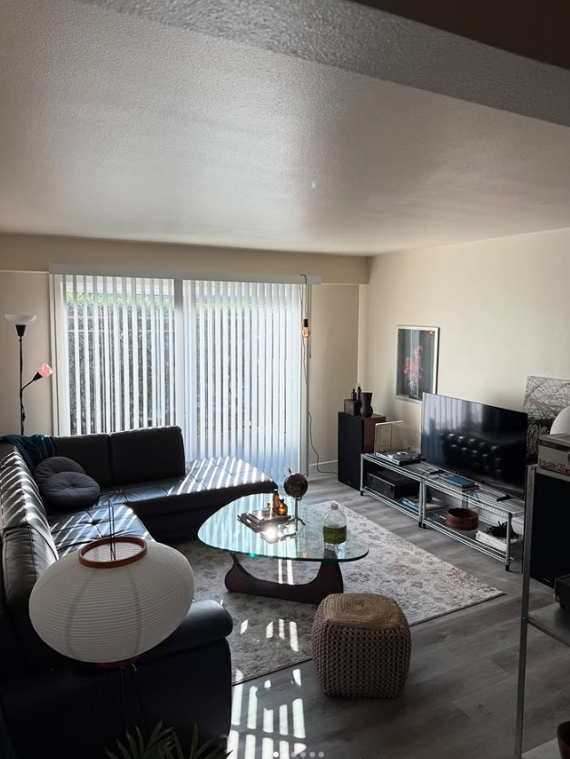
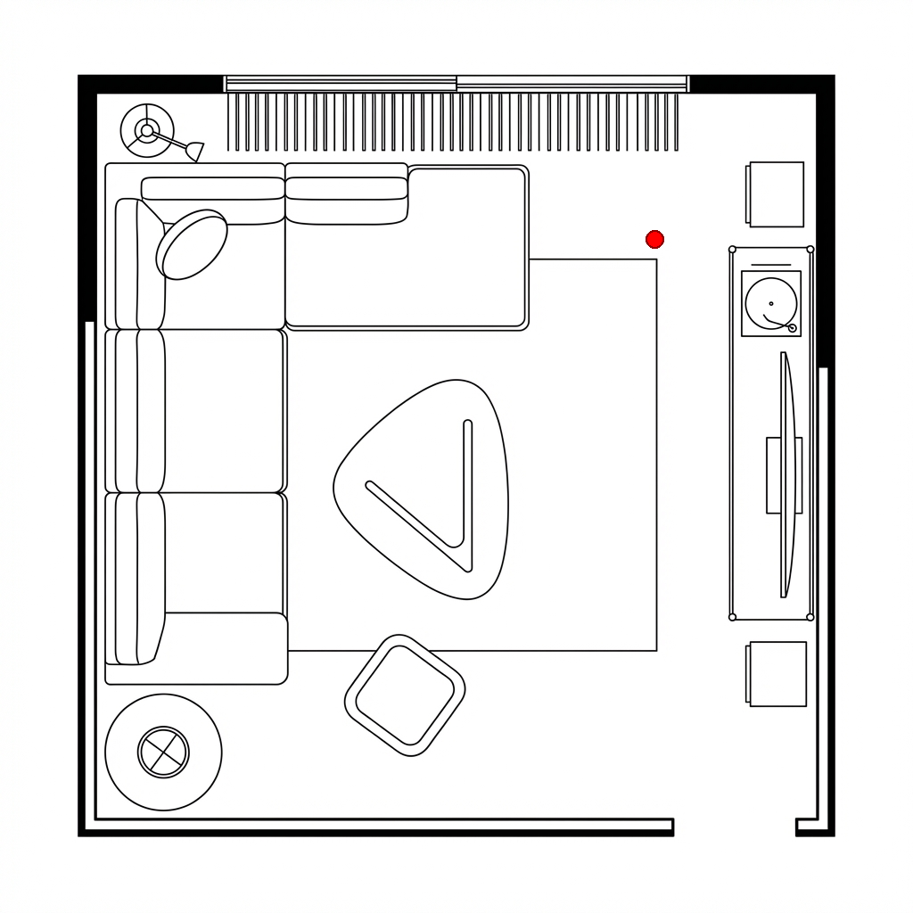
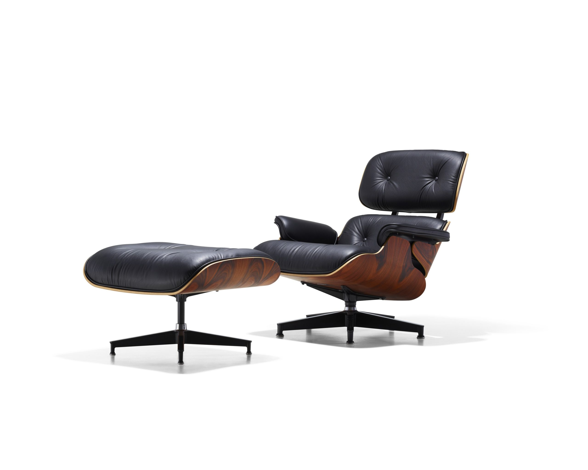
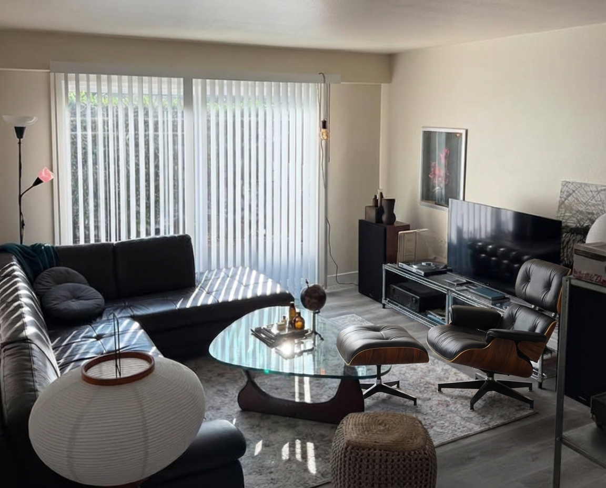
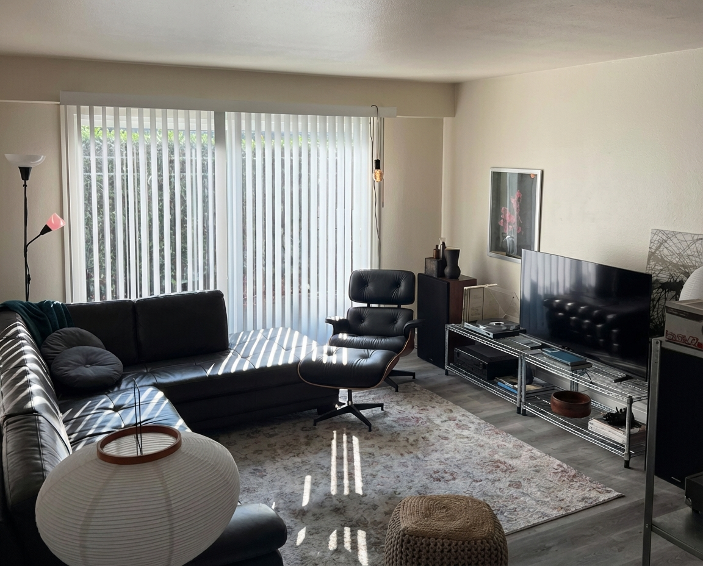

# Interior Design Image Editing Application

Proper Documentation for this project will be released when full implementation is completed.

This is a personal passion project I'm creating to help me prototype changes that I make to my interior spaces. I often find that interacting with the regular Gemini interface can be quite frustrating at times, especially when I want to add SLIGHT adjustments to my space (ie. a new lamp, a different shade color, etc.). This app will allow for a form of "visual prompting" which allows close-hands control of how the scene changes.

## Approach

The idea I have in mind is to explore the idea of "visual prompting" I mentioned earlier. This is inspired by a work a PhD I've worked under did recently:

**GenEscape: Hierarchical Multi-Agent Generation of Escape Room Puzzles**
Mengyi Shan, Brian Curless, Ira Kemelmacher-Shlizerman, Steve Seitz
[arXiv:2506.21839](https://www.arxiv.org/abs/2506.21839)

What I want to do is use the layout sketch as a base for the user, through an interactive window, to add "prompt" objects, containing the image of the base furniture piece, the orientation of the piece, and descriptions of it's state. They can then directly control WHERE to place the object by dragging a pointer across the layout window to where they'd like the object to lie. 

The hope is that this delivers an easy to control method for prototyping small changes to an interior space.

| Original Image | Generated Floor Plan |
|----------------|----------------------|
|  |  |

*Prompt: "room layout, floor plan, interior layout, top-down, black white"*


## Implementation Notes

Daily development journal tracking progress, learnings, and challenges.

---

### 1/25/2026 Updates

**Early Implementation Takeaways:**

I messed around with the "visual prompting" idea to get some more insight.

I was initially prompting with just 3 images & prompt (1. base image, 2. item, 3. layout with red dot to signify location, and lastly a text prompt describing orientation)

This didn't lead to satisfying results & the item placement was completely off. 

| Original Image | Layout with Marker | Item to Place | Final Output |
|----------------|-------------------|---------------|--------------|
|  |  |  |  |

* Prompt: "facing towards camera"

I then thought about maybe passing the red dot localization through a image to text pipeline to better describe location & it worked well. While it theoretically defeats the point of even having the interactive layout layer in the first place, I found that this is a great way to work around having to manually pinpoint the *exact* place you'd like to reference in words. The output still has issues (the coffee table is removed, potentially since theres no real room for the chair to be placed with it still there)

| Original Image | Layout with Marker | Item to Place | Final Output |
|----------------|-------------------|---------------|--------------|
|  |  |  |  |

* Prompt: "facing towards camera"

---

### Install Dependencies

```bash
# Create a virtual environment (recommended)
python -m venv venv

# Activate virtual environment
# On Windows:
venv\Scripts\activate
# On macOS/Linux:
source venv/bin/activate

# Install dependencies
pip install -r requirements.txt
```

### Configure API Keys

Copy the example environment file and add your API keys. Currently I'm buildingt the project around the Google AI studio API services:

```bash
cp .env.example .env
```
```